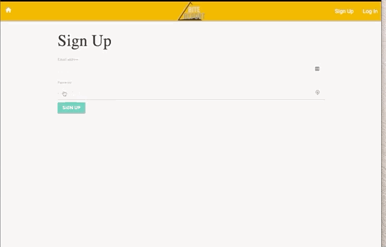
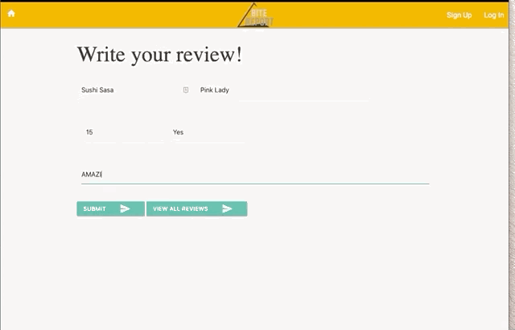

  

  # BiteReport

  ## Description
 The app that lets you save your own personal food reviews from any restaurant you visit.

  

  

  

## Deployed Webiste

  ## Table of Contents
  * [Description](#Description)
  * [Deployed Website](#Deployed)
  * [Installation](#Installation)
  * [Usage](#Usage)
  * [Contributing](#Contributing)
  * [Tests](#Tests)
  * [Questions](#Questions)
  * [Author](#Author)
  * [License](#License)

  ## Installation
  This application is installed via node.js, Sequelize, Handlebars,  with npm dependency.

  ## Usage
  A restaurant app that enables a user to save information about restaurant menu items. You can save information about a dish or drink you tried, and the ingredients used.

  ## Contributing
  If you'd like to expand upon this application, please fork the repository and code away. You may also reach out to the developers directly if you wish to collaborate.

  ## Tests
  To test the code, you can run via VScode or any other coding platform. Open a browser and connect to your local host and database.

  ## Questions
  Please send any questions or comments to the author listed below.

  ## Author:
  Claudion Gallo, Jake Haberle, Metasabeya Ketsela, Keldan Cundy, Gabrielle Maxey

  Email:

  Github: mrclaudiogallo GabrielleM45 jhaberle metasabeya keldykins>

  ## License
  *This application is Licensed under the following license:*\
  **[mit](https://choosealicense.com/licenses/mit/)**

